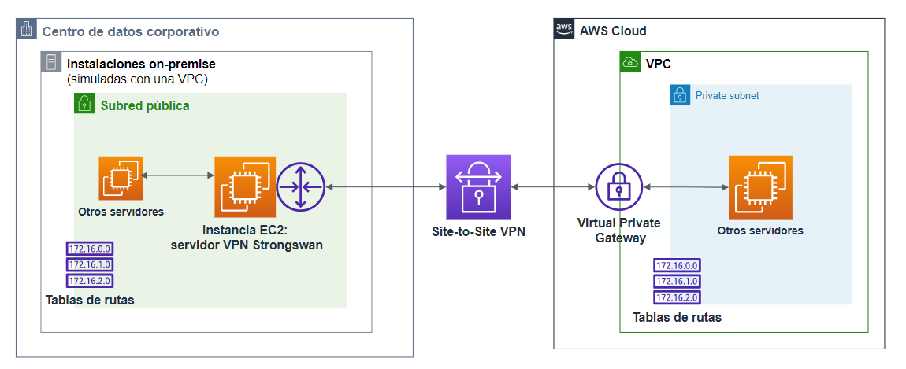
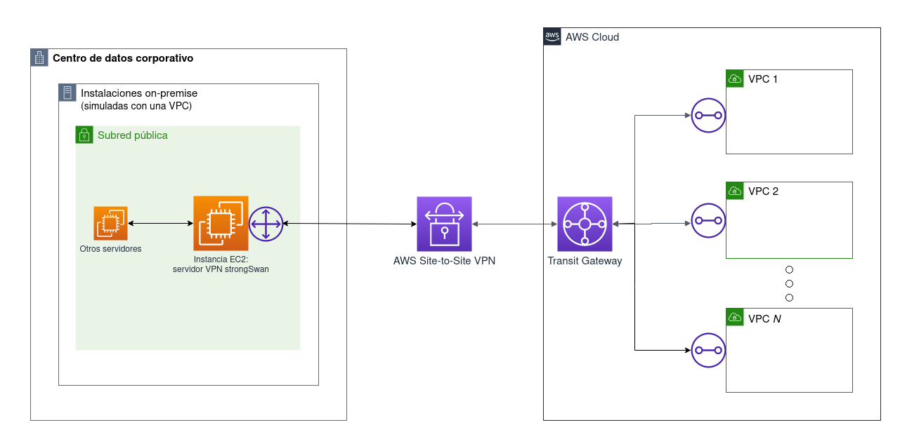
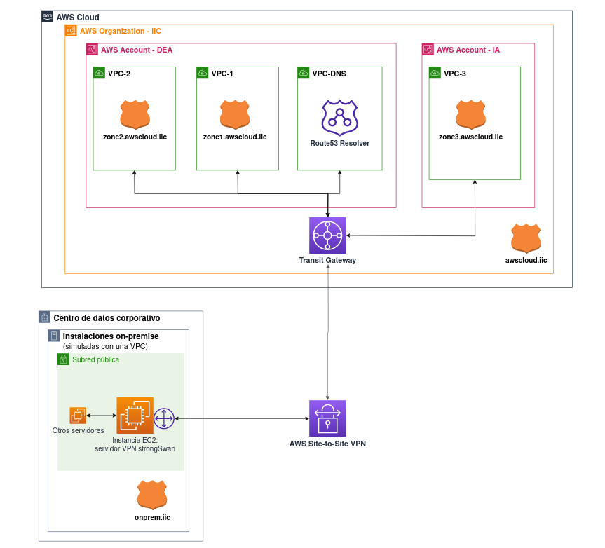

# Proyecto de investigación
<table>
    <tr><th colspan="2" style="font-size: x-large">Nombre de la tecnología investigada</th></tr>
    <tr><th>URL oficial</th><td><a href="https://aws.amazon.com/es/transit-gateway/">AWS Transit Gateway</a> <a href="https://docs.aws.amazon.com/es_es/Route53/latest/DeveloperGuide/resolver.html">Amazon Route 53 Resolver</a></td></tr>
    <tr><th>Ámbito de aplicación</th><td>Cloud híbrida</td></tr>
    <tr><th>Tecnologías relacionadas</th><td><ul><li>AWS CloudFormation</li><li>AWS Resource Access Manager</li><li>AWS Site-to-Site VPN</li><li>strongSwan</li></ul></td></tr>
    <tr><th>Última revisión</th><td>2023-01-06</td></tr>
</table>

# Principales características

Desarrollo de un sistema de automatización del despliegue, gestión y monitorización de nubes híbridas en AWS. Para simular el entorno on-premise de la hibridación se utiliza una VPC de AWS, y para desplegar los túneles VPN se utiliza strongSwan.

Tres arquitecturas desplegables de forma automática:

1. **Arquitectura híbrida one-to-one**: una sola VPC conectada al on-premise a través de un túnel VPN, utilizando AWS Site-to-Site VPN con un Virtual Private Gateway como VPN endpoint. Para desplegarla, ubicarse en la carpeta _despliegue_infra_vpg_ y ejecutar el script con `python3 despliegue_infra_vpg.py`.

 

2. **Arquitectura híbrida one-to-many**: múltiples VPC conectadas a un Transit Gateway, que se conecta a su vez con el on-premise a través de un AWS Site-to-Site VPN. Para desplegarla, ubicarse en la carpeta _despliegue_infra_transitgw_ y ejecutar el script con `python3 despliegueInfraTransitGateway.py N`, siendo N el número de VPC que se desea desplegar.

 

3. **Arquitectura híbrida one-to-many con resolución de DNS centralizada**: despliega un Transit Gateway al que se conectan dos VPC normales por defecto, además de una VPC que aloja un Route 53 Resolver capaz de centralizar la resolución de DNS del entorno on-premise y de todas las VPC de forma automática. Crea hosted zones para el entorno local (_onprem.iic_) y para las dos VPC por defecto (_zone1.awscloud.iic_ y _zone2-awscloud.iic_): si se despliega un servicio en la VPC-1 y se desea propagar su DNS, solamente hay que añadir un registro a la hosted zone de VPC-1, por ejemplo, _registro.zone1.awscloud.iic_. El Route53 Resolver lo propagará de forma automática a las demás VPC y al entorno on-premise. 

Para desplegarla, ubicarse en la carpeta _gestionDNScentralizado_ y ejecutar `python3 despliegueInfraDnsCentralizado.py`. 

Además, incluye la posibilidad de desplegar una VPC desde otra cuenta de AWS y conectarla a este Transit Gateway, pudiendo conectar VPC de varias cuentas y centralizando el paso de todo el tráfico de todas las cuentas por el mismo Transit Gateway. Para hacerlo, se deben compartir desde la cuenta desde la que se ha desplegado la VPC que aloja el Route53 Resolver los siguientes tres recursos a través de AWS Resource Access Manager:
- El Transit Gateway
- La Route53 Resolver Rule que permite la resolución de DNS hacia el servidor DNS local: _MyOnPremRule_
- La Route53 Resolver Rule que permite la resolución de DNS hacia las VPC: _MyAWSRule_

Estos tres recursos deben ser compartidos desde la cuenta que aloja el Resolver para la cuenta desde la que se desea desplegar la VPC en específico. Luego, deben ser aceptados desde la cuenta desde la que se desea desplegar la VPC. Una vez hecho, se debe ejecutar el comando `python3 despliegueNubeOtherAcc.py`. El script está diseñado para que se despliegue la arquitectura principal desde la cuenta de AWS de DEA, y la VPC de otra cuenta desde la cuenta de IA.

 

**BORRADO DE INFRAESTRUCTURA**

Si se despliega la infraestructura usando gestionDNSCentralizado, se debe borrar manualmente:
1. Primero, borrar las instancias o demás recursos que se hayan desplegado manualmente después del despliegue (que hayas desplegado tú, no el script)
2. Borrar las Hosted Zones desde Route 53 (onprem.iic, zone1.awscloud.iic y zone2.awscloud.iic)
3. Borrar los stacks de CloudFormation en este orden: vpc-nube1 y vpc-2 primero, luego vpn-server, luego vpc-dns y finalmente vpc-onpremise

# Conclusiones

En cuanto al código de este repositorio en concreto, simplemente simula como desplegar una arquitectura híbrida de forma automática, por lo que su aplicabilidad real es limitada. Sin embargo, ha servido para investigar dos servicios de AWS que pueden ser interesantes: Transit Gateway y Route 53 Resolver.

Transit Gateway permite establecer un punto central que interconecte todo tipo de redes en AWS. Así, al desplegar una entorno híbrido, puede ser de gran utilidad: permite conectar en un mismo punto tanto una conexión VPN o Direct Connect para conectar el entorno on-premise como múltiples VPCs (hasta 10.000). Además, si se comparte el Transit Gateway a través de AWS RAM, se pueden conectar a este VPCs que pertenezcan a otras cuentas de AWS. Así, un Transit Gateway puede ofrecer una solución centralizada para conectar todo el tráfico de una organización a la nube.

Route 53 Resolver, de implementarse como está configurado en este proyecto, permite centralizar y automatizar la resolución de DNS de toda una red híbrida. Así, un registro de DNS creado en cualquier punto de la red (en la nube o en on-premise) se propagará a todas partes de forma automática y podrá ser resuelto desde cualquier punto de esta. Así, la gestión del DNS de la organización se simplifica mucho.

# Trabajo futuro

A nivel del código de este repositorio, sería interesante desarrollar un script que automatice el borrado de la infraestructura desplegada. Ahora mismo, hay que borrar los stacks de CloudFormation manualmente (además de alguún recurso más como las Hosted Zones), lo que lleva un tiempo.

En cuanto a investigación, la utilización de Transit gateway, al ser un punto central para todo el tráfico de una red híbrida, ofrece un punto idóneo para monitorizar el tráfico de red. Usando servicios de AWS, estás son las posibilidades: https://docs.aws.amazon.com/vpc/latest/tgw/transit-gateway-monitoring.html

# Referencias

- [Tutorial AWS: como centralizar la resolución de DNS](https://aws.amazon.com/es/blogs/security/simplify-dns-management-in-a-multiaccount-environment-with-route-53-resolver/)
- [Tutorial AWS: como simular Site-to-Site VPN usando strongSwan](https://aws.amazon.com/es/blogs/networking-and-content-delivery/simulating-site-to-site-vpn-customer-gateways-strongswan/)
- Memoria TFG de Luis Travé: VPN-Cloud/assets/TFG-LuisTrave.pdf

